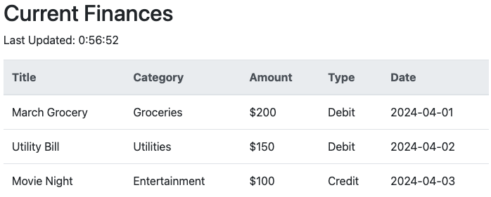

# Full Stack App
**Lab 9**

---
layout: default
---

# Prerequisites
- Frontend from Lab 7: Add Income and Add Expense Pages
- `fetch` API from lab 8 : Managing `GET` and `POST` endpoins.
- `expressjs` : Creating a simple server.
- `Google App Engine` : Deploying the server.


<div class="neversink-violet-scheme ns-c-bind-scheme">

### Everything is done _Inside_ the cloned repo.

</div>

---
layout: top-title
align: l
color: dark
---

::title::

# Web Architecture

::content::


1. Load the HTML page
2. User interacts with the page
3. Client Side JavaScript uses `fetch` to make a request to the server
4. Server processes the request
5. Server Interacts with the database
6. Server sends a response back to the client
7. Client Side JavaScript updates the page with the response
8. User sees the updated page

---
layout: top-title
align: l
color: dark
---

::title::

# Integrating Backend with Frontend

::content::

### Setting up an ExpressJS Server

We have done this atleast 5 times. Let's do it again.[reference](https://gist.github.com/ninadpchaudhari/b66c74ae464e2b295459e7028b368ea9#create-a-new-nodejs-project)

### Recall: Follow these steps to create a basic `expressjs` server:

<v-clicks>

1. Create a new folder for the server.  
2. Initialize a new NodeJS project using `npm init -y`.  
3. Install `express` using `npm install express`.  
4. Create a new file named `server.js`.  
5. Add a GET route at `/hello` that returns `Hello World!` as `text` type.  
6. Start the server application using the appropriate command.  
7. Verify the server is running by opening the URL in the browser.  
8. Add `.gitignore` file if you haven’t already done so.  

</v-clicks>

---
layout: top-title
align: l
color: dark
---
::title::

# Debugging Enabling CORS for Frontend Access

::content::

## Do this if you get CORS errors! Skip otherwise.
### What is CORS?
CORS is a security feature implemented by web browsers to prevent malicious websites from making requests to a different domain than the one that served the original page. 

When your frontend (running on `localhost:3000`) tries to access your backend (running on `localhost:5000`), the browser blocks the request because it considers it a cross-origin request.
### Solution

<v-clicks>

1. Install the CORS package:  
   ```bash
   npm install cors
   ```
2. In your `server.js` file, add this:  
   ```js
   const cors = require('cors');
    app.use(cors());
   ```
3. This will allow all origins to access your server. ( you can adjust in prod as required later )

</v-clicks>


---
layout: top-title
align: l
color: dark
---

::title::

# Integrating Backend with Frontend

::content::

## Adding a Simple HTML Page

This is how we configure the server to serve _static_ files. `static` files are files that are not generated dynamically by the server. They are served as-is to the client. Example : HTML, CSS, JS, images, etc.

<v-clicks>

1. Create a new folder named `public` in the root directory of the server.
2. Create a simple HTML file under the `public` directory. A boilerplate page from getbootstrap.com is perfect.
3. Configure `expressjs` to serve static files from `public` at `/`. 
   
    ```js {none|1|2} 
    const app = express();
    app.use('/', express.static('public')); // Add this line!
    ```
    
4. Use `express.static` to serve the HTML page.
5. Start the server and access the HTML page at `http://localhost:3000`.  
   _Reference: [ExpressJS Documentation: express.static](https://expressjs.com/en/starter/static-files.html)_
</v-clicks>

---
layout: two-cols-title
columns: is-3
align: c-c-lt
---

:: title ::

### 🎉 **Full Stack Achieved!**

:: left ::

<p></p>
<p></p>
<IceCream :size="150" mood="excited" color="#FDA7DC" />

:: right ::

## Yay! You now have a ==Full Stack== App!

- 📦 Static assets? ✅  
- 💽 API? ✅  
- Connected frontend? ✅  
- Just that they don’t use the same data yet / consume the API.


> Keep it clean, commit often, and deploy proudly!


---
layout: side-title

---

::title::

## Let's add more Frontend ->

::content::

# Page : Current Finances
Let's create a page that shows the current finances.
1. Use Bootstrap starter template to create `finances.html` in the `public` folder.
2. Augment that page with this HTML Snippet.
```html
<div class="container">
  <h2>Current Finances</h2>
  <p id="updateTime"></p>
  <table class="table">
    <thead class="table-light">
      <tr>
        <th scope="col">Title</th>
        <th scope="col">Category</th>
        <th scope="col">Amount</th>
        <th scope="col">Type</th>
        <th scope="col">Date</th>
      </tr>
    </thead>
    <tbody id="financeData">
      <!-- Finance data will be dynamically inserted here -->
    </tbody>
  </table>
</div>
```

---
layout: two-cols-title
columns: is-6
align: l-lt-lt
---

:: title ::

# Page : Current Finances

:: left ::

Add the following to begin with. 

<v-clicks>

1. Fetch the data from the server
2. Display it in the table.
3. Then update the last updated time.

</v-clicks>

```js {none|2|3|4|all}{at:1} twoslash
let financeData = {}; // Object to store finance data
fetchFinanceData(); // Populate the financeData array
displayFinanceData(); // Display the data in the table
updateLastUpdatedTime(); // Update the last updated time
```

:: right ::

Does your front work?
<v-click>
Copy the javascript code from my CodePen.
</v-click>


---
layout: iframe-left

# the web page source
url: https://codepen.io/ninadpchaudhari/embed/gbbrdYd?default-tab=js

---

# Page : Current Finances

## I have added function bodies to the earlier code.
Use the codepen on left to get the full code.

Logic remains the same. 
1. Fetch the data from the server
   - Just that now instead of getting the JSON from the server
   - We are populating the `simulatedReturnValue` variable.
2. Display it in the table.
3. Then update the last updated time.


---
layout: default

---

## Task : Complete the Frontend.

### The table should look like this:
<p></p>



---
layout: section
color: sky-light
---
# Let's focus on the backend API.

---
layout: two-cols-title
columns: is-6
align: l-lt-lt
---

Checkout the [Server-side JS module on Canvas for help](https://canvas.siena.edu/courses/19155/modules/127497)
:: title ::

## Create a new API endpoint to get the finances data.

:: left ::

### API : `GET /api/finances`

<div class="ns-c-tight">

1. Define a JavaScript variable `transactions` inside your Express server.
(You do not need a database or file. Just use a simple JS array.)
2. This variable should contain the finances data in the format shown on the right.
3. Create a `GET` endpoint at `/api/finances`.
4. The endpoint should:
   1. Respond with status: `200 OK`
   2. Return the JSON object: `{ transactions: [...] }`
5. Test by visiting http://localhost:3000/api/finances in the browser or Thunderclient.
</div>

::right::

```json 
{
    transactions: [
      {
        title: "March Grocery",
        category: "Groceries",
        amount: "$200",
        type: "Debit",
        date: "2024-04-01"
      },
      {
        title: "Utility Bill",
        category: "Utilities",
        amount: "$150",
        type: "Debit",
        date: "2024-04-02"
      }
    ]
}
```
---
layout : top-title
align: l
color: emerald
---

Don't recall ? Detailed instructions on next slide. Also, [First Slide - JS Fetch module on Canvas for help](https://canvas.siena.edu/courses/19155/modules/127496/collapse)

::title::

# Consume this API in the Frontend

::content::

### Modify the Frontend to consume the API

1. In the `finances.html` file, locate the `fetchFinanceData` function.

2. Replace its contents with a new function that:
   - Uses the `fetch()` API to make a `GET` request to the `/api/finances` endpoint.
   - Parses the response using `.json()`.

3. Once the data is received:
   - Update the `financeData` variable with the `transactions` array from the response.
   - ✅ **Then call** the `displayFinanceData()` function **after** the variable is updated.

---
layout: default
---
ddd


---
layout: two-cols-title
columns: is-6
align: l-lt-lt 
---

::title::

# Example: Fetching users using `fetch()`

::left::

### How `fetch()` Works, Recap

<v-clicks class="ns-c-tight">

- `fetch(url)` sends a GET request and returns a **Promise** for a `Response`.

- Check if the response is OK using `statusCheck(response)`  
  → If not, throw an error before trying to read the data.

- Parse the data using `response.json()`  
  → Converts the raw response into a usable JavaScript object.

- Pass the parsed data to a handler function like `processData()`  
  → This is where you update the UI or store values.

- Use `.catch()` to handle network or parsing errors  
  → Errors should be logged or shown to the user clearly.
 
</v-clicks>
::right::

### Promises with `.then()`

<div class="overflow-auto max-h-[400px]  rounded ">

```js
const BASE_URL = "https://randomuser.me"; // Use a single base URL for this example

function makeRequest() {
 // API Documentation https://randomuser.me/documentation
  let url = BASE_URL + "/api/?results=3"; // Customize this query string as needed

  fetch(url)
    .then(statusCheck)
    .then(resp => resp.json()) // use .text() instead if the response is plain text
    .then(processData)
    .catch(handleError); // You can define this to show a user-friendly message
}

function processData(responseData) {
  // TODO: Display data in the DOM — e.g., populate a table or list
}

async function statusCheck(res) {
  if (!res.ok) {
    throw new Error(await res.text());
  }
  return res;
}
function handleError(err) {
  console.error("An error occurred:", err.message);
  alert("Something went wrong. Please try again later.");
  // or update a <div id="error"> element
}
```
</div>


---
layout: two-cols-title
columns: is-6
align: l-lt-lt 
---

:: title ::

# fetch() Recap and ==Parable==

:: left ::


- We all are humans. 
- It's hard to remember all the details.
- Snippets of code are like recipes.
- They help us remember how to cook.
  
<StickyNote
  color="amber-light"
  textAlign="left"
  width="180px"
  style="transform: rotate(-5deg);"
  title="Maintain a Notebook"
> 

<div class="ns-c-tight">

- Keep a notebook of code snippets.
- Use it to recall how to use `fetch()`.
- It will save you time and effort.
</div>
</StickyNote>
<div class="relative left-90 -top-110">
  <Mug :size="40" mode="happy" />
</div>

:: right ::

<v-click >

Can you recall other things you can do with `fetch()`?
- `POST` data to the server
</v-click>

<v-click>
<Admonition title="Info" color='teal-light' width="300px">
How about other things you can add to this notebook?
</Admonition>
</v-click>

---
layout: top-title-two-cols
columns: is-6
align: l-lt-lm
color: dark
---

::title::

## Create a POST API endpoint to receive expense data


::left::

<span class="text-sm">This is similar to the Quotes API we did in previous lab</span>
<v-clicks class="ns-c-tight  text-sm">

1. Reuse the **expenses form** from Lab-6 (`add_expense.html`). 
2. It should collect data such as title, amount, category and the otehr fields.
3. In your Express server, define a `POST` endpoint at `/api/expenses`.
4. This endpoint should:
   - Accept JSON data from the frontend form
   - Validate the fields (e.g., title, amount should not be empty)
   - Add the received object to a `simulatedData` array in memory
5. Refer to your `POST` examples from Lab-7 and lecture demos.  
   (`fetch(..., { method: 'POST', body: ... })` pattern)
6. Test by visiting:  
   `http://localhost:3000/public/add_expense.html`  
   → Submitting the form should store the data to server-side.

</v-clicks>

::right::

### API: `POST /api/expenses`

This endpoint expects request in the following format:

```json
{
  "title": "Snacks",           // (string) short name for the expense
  "category": "Food",          // (string) category label
  "amount": "$10",             // (string) amount with currency
  "date": "2025-04-22"         // (string) date format
} 
```

The sever responds with
```json
{
  "status": "success",
  "message": "Expense added successfully"
}
```
<v-click class="text-sm">

> Recall, in class we saw how to support many request formats, not just json.
> Tip: If you're not using string values like `"$10"`, update `"amount"` to a number (`10.00`).
</v-click>

---
layout: intro
color: white
---


## Congratulations! 🎉
### We just created a full stack app.


Things to submit on Canvas: 
<div class="ns-c-tight">

- Your codebase, zipped.
- A link to your deployed app. (Google App Engine's URL)
- The link to your GitHub repo.
</div>