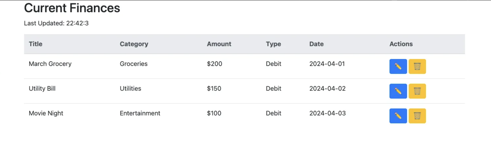

# Working with Databases
**Lab 10**

---
layout: default
---

# Prerequisites

- `fetch` API from lab 8 : Managing `GET` and `POST` endpoins.
- `expressjs` : Creating a simple server.

- You have accepted the Github Classroom Assignment and have a repository to work together.

# GitHub Codespaces (optional to speedup development)
- Create a codespace using `New with options...`
- Choose a `4 core` machine to save time!
- Install the `Live Share` plugin so your partner can live edit the code.

<div class="neversink-violet-scheme ns-c-bind-scheme">

### Everything is done _Inside_ this repository.

</div>

---
layout: top-title
align: l
color: dark
---

::title::

# The Three Parts of a Web Application

::content::

## The Three Parts of a Web Application

- **Frontend**: User interface built with HTML, CSS, and JavaScript.
- **Backend**: Server-side logic and data processing (e.g., Node.js).
- **Database**: Stores and manages data (e.g., MySQL, MongoDB).
- **API**: Connects frontend and backend for data exchange.
- **Full Stack**: Combines all three for a complete app.

---
layout: top-title
align: l
color: dark
---

::title::

# Integrating Backend with Frontend

::content::

### Setting up an ExpressJS Server

We have done this atleast 7 times. Let's do it again.[reference](https://gist.github.com/ninadpchaudhari/b66c74ae464e2b295459e7028b368ea9#create-a-new-nodejs-project)

### Recall: Follow these steps to create a basic `expressjs` server:

<v-clicks>
<div class="ns-c-tight">

1. Assuming you are on the repository root,
2. Initialize a new NodeJS project using `npm init -y`.
   -  This should create a `package.json` file.
3. Install `express` using `npm install express`.  
4. Create a new file named `server.js`.  
5. Add a GET route at `/hello` that returns `Hello World!` as `text` type.  
6. Start the server application using the appropriate command.  
7. Verify the server is running by opening the URL in the browser.  
8. Add `.gitignore` file if you haven’t already done so.  

</div>
</v-clicks>

---
layout: top-title
align: l
color: dark
---
::title::

# Debugging Enabling CORS for Frontend Access

::content::

## Do this if you get CORS errors! Skip otherwise.
### What is CORS?
CORS is a security feature implemented by web browsers to prevent malicious websites from making requests to a different domain than the one that served the original page. 

When your frontend (running on `localhost:3000`) tries to access your backend (running on `localhost:5000`), the browser blocks the request because it considers it a cross-origin request.
### Solution

<v-clicks>

1. Install the CORS package:  
   ```bash
   npm install cors
   ```
2. In your `server.js` file, add this:  
   ```js
   const cors = require('cors');
    app.use(cors());
   ```
3. This will allow all origins to access your server. ( you can adjust in prod as required later )

</v-clicks>


---
layout: top-title
align: l
color: dark
---

::title::

# Integrating Backend with Frontend

::content::

## Adding a Simple HTML Page

This is how we configure the server to serve _static_ files. `static` files are files that are not generated dynamically by the server. They are served as-is to the client. Example : HTML, CSS, JS, images, etc.

<v-clicks>

1. Create a new folder named `public` in the root directory of the server.
2. Create a simple HTML file under the `public` directory. A boilerplate page from getbootstrap.com is perfect.
3. Configure `expressjs` to serve static files from `public` at `/`. 
   
    ```js {none|1|2} 
    const app = express();
    app.use('/', express.static('public')); // Add this line!
    ```
    
4. Use `express.static` to serve the HTML page.
5. Start the server and access the HTML page at `http://localhost:3000`.  
   _Reference: [ExpressJS Documentation: express.static](https://expressjs.com/en/starter/static-files.html)_
</v-clicks>

---
layout: two-cols-title
columns: is-3
align: c-c-lt
---

:: title ::

### 🎉 **Full Stack Achieved!**

:: left ::

<p></p>
<p></p>
<IceCream :size="150" mood="happy" color="#FDA7DC" />

:: right ::

## Yay! You know these step now!

- 📦 Static assets? ✅  
- 💽 API? ✅  
- Connected frontend? ✅  
- Just that they don’t use the same data yet / consume the API.


## YOU ADDING things to your notebook?

> Keep it clean, commit often, and deploy proudly!


---
layout: side-title
---

::title::

## Let's add more Frontend ->

::content::

# Page : Current Finances
Let's create a page that shows the current finances.
1. Don't use Bootstrap! Just a simple HTML page named `chinook_invoices.html` in the `public` folder.
2. Add the HTML boilerplate code.
3. Add the following CSS 


```css {*}{maxHeight:'200px'} 
body {
    font-family: Arial, sans-serif;
    margin: 0;
    padding: 0;
    background: #f4f4f4;
}

.container {
    width: 80%;
    margin: 20px auto;
}

.invoice-item {
    background: #fff;
    border: 1px solid #ddd;
    border-radius: 5px;
    padding: 15px;
    margin-bottom: 10px;
    box-shadow: 0 2px 4px rgba(0, 0, 0, 0.1);
}

.invoice-item h2 {
    margin-top: 0;
}

.invoice-item p {
    margin: 5px 0;
} 
```

---
layout: iframe-right
url: https://codepen.io/ninadpchaudhari/embed/azzLRRx?default-tab=js
---


# Augment your work with these at appropriate places. 


### Adding HTML

```html

    <div class="container" id="invoice-items-container">
        <div class="invoice-item">
            <h2>Static Item</h2>
            <p>Invoice ID: 100</p>
            <p>Track ID: 345</p>
            <p>Unit Price: $free.99</p>
            <p>Quantity: 1</p>
        </div>
        <!-- Invoice items will be inserted here -->
    </div>

```

---
layout: image-left
image: ./images/chinook-invoices.png
---

# Complete the code to show the invoice items.

### Your HTML page should look like the image on left.

### Hints
- Use `creatElement` to create the elements.
- Use `appendChild` to add the elements to the page.
- Use `innerText` to add the text to the elements.

--- 
layout: top-title
align: l
color: dark
---


::title::

# Create a new API endpoint to get the invoices

::content::

### API : `GET /chinook/invoices`
- Create a new API endpoint in your `server.js` file.
- Use the `sqlite3` package to connect to the database.
  - Refer to the class notes for the code!
- You will need to use SELECT QUERY to get the invoices.
- Use `res.status(200).json(data)` to send the data back to the client.
- Test the API using Yet Another REST Client (YARC) or Thunderclinet.

--- 
layout: top-title
align: l
color: emerald
---
::title::

# Consume this API in your HTML page

::content::

### Fetch the data from the API

- Use the `fetch` API to get the data from the API.
- HINT : Use previous lab to see the code of fetch... 
- You should have this code in your notebook by this point.

- Once you fetch the data, you need to loop through the data and create the HTML elements.

> Your HTML page should show all the invoices from the Chniook database.

---
layout: section
color: sky-light
---


# Let's work to enhance your work from previous lab.

Moving away from chinook for a moment.!

---
layout: top-title
align: l
color: blue
---

::title::

# Practicing INSERT & SELECT

Recollect in the previous lab, we made many Endpoints..

- `GET /api/transactions` to get all the transactions that we stored in an array.
- `POST /api/expenses` to receive transactions to receive expenses

::content ::
### Instead of saving transactions to an array, Let's the app so that we use database to store all of this info instead.

--- 
layout: top-title
align: l
color: blue
---

::title::

# Setting up SQLite Database

::content::

### Setting up SQLite Database

- Create a new SQLite database file named `transactions.db` in the root directory of your project.
```sql
CREATE TABLE IF NOT EXISTS transactions (
  id INTEGER PRIMARY KEY AUTOINCREMENT,
  description TEXT,
  amount REAL,
  date TEXT,
  category TEXT
);
```
- Use your VSCode Extension to see this table.
- Add some sample data to the table using SQLite commands.

---
layout: top-title
align: l
color: blue
---

::title::

# Adding a New API Endpoint GET Transactions

Consider this: Your client-side code is already using the `GET` API to get all the transactions.
- You need to create a new API endpoint to get all the transactions from the database instead of the array.

::content::

### API : `GET /api/transactions`
- Create a new API endpoint in your `server.js` file.
- Use the `sqlite3` package to connect to the database.
- Use the `SELECT` command to get all transactions from the database.
- Use `res.status(200).json(data)` to send the data back to the client.
- Test the API using Yet Another REST Client (YARC) or Thunderclinet.

> Copy the `finances.html` page to `transactions.html` and use the same code to show the transactions.

--- 
layout: top-title
align: l
color: blue
---

::title::

# Adding a New API Endpoint
::content::
### API : `POST /api/transactions`
- Create a new API endpoint in your `server.js` file.
- Use the `sqlite3` package to connect to the database.
- Use the `INSERT` command to add a new transaction to the database.
- Use `res.status(200).json(data)` to send the data back to the client.
- Test the API using Yet Another REST Client (YARC) or Thunderclinet.

> Create a simple HTML form to add a new transaction.
- Use `fetch` API to send the data to the server.
- Use `POST` method to send the data to the server.

---
layout: top-title
align: l
color: blue
---

::title::
# Add an endpoint to DELETE a transaction

::content::

### API : `DELETE /api/transactions/:id`
- Create a new API endpoint in your `server.js` file.
- Use the `sqlite3` package to connect to the database.
- Use the `DELETE` command to delete a transaction from the database.
- Use `res.status(200).json(data)` to send the data back to the client.
- Test the API using Yet Another REST Client (YARC) or Thunderclinet.
- Use the `id` parameter to delete the transaction.

---
layout: top-title
align: l
color: blue
---

## Think how we would complete the finances.html page



---
layout: top-title
align: l
color: blue

---

::title::
# Adding a Delete Button

::content::


- How do you implement the `DELETE` API in your HTML page?
- Use `fetch` API to send the data to the server.
- Use `DELETE` HTTP-method to send the data to the server.
- When creating the HTML elements, add a button to delete the transaction.
- Use `addEventListener` to listen for the click event on the button.

> Hint on next page.


---
layout: top-title
align: l
color: blue
---

::title::

# Adding a Delete Button

::content::


```html
<table id="myTable">
  <tr>
    <td>March Grocery</td>
    <td><button class="delete" data-index="0">🗑️ Delete</button></td>
  </tr>
  <tr>
    <td>Utility Bill</td>
    <td><button class="delete" data-index="1">🗑️ Delete</button></td>
  </tr>
</table>

```
```js 


    const index = event.target.dataset.index;  // <-- this is the key
    console.log('Clicked delete for index:', index);
```
  
---
layout: section
color: sky-light
---

# Thank you for your time!