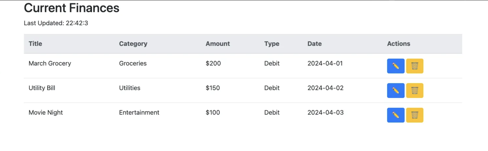

# Working with Databases
**Lab 10** — Persisting your Lab 9 server with `node:sqlite`

---
layout: default
---

# Where we left off (Lab 9)

By the end of **Lab 9** you had:

- An **Express** server with these endpoints:
  - `GET /hello`, `GET /api/time`, `GET /api/greet/:name`, `GET /api/math`
  - `GET /api/slow`, `GET /api/unreliable`, `GET /api/headers`
  - **`GET /api/messages`** and **`POST /api/messages`** &mdash; backed by an **in-memory array**.
- A `public/index.html` that calls those endpoints using `fetch()` with `.then()`/`.catch()` **and** `async`/`await`.
- A working form that POSTs `{ text, author }` to `/api/messages` and re-fetches the list.

# The problem
> Restart the server &rarr; every message disappears. An array in memory is not persistence.

<div class="neversink-violet-scheme ns-c-bind-scheme">

### Lab 10 goal: replace that array with a real **SQLite database** using Node.js's **built-in** `node:sqlite` module.

</div>

---
layout: default
---

# Prerequisites

- Your **Lab 9** repository (Express + `public/index.html` + `fetch`).
- You accepted the Lab 10 GitHub Classroom assignment and are working in that repo **with your partner**.
- **Node.js v22.5+** (required for `node:sqlite`). Codespaces and recent installs are fine.

# GitHub Codespaces (recommended)
- Create a codespace using `New with options...`
- Choose a **4 core** machine to save time.
- Install the **Live Share** plugin so your partner can edit live.

<div class="neversink-violet-scheme ns-c-bind-scheme">

### Everything is done _inside_ this repository.

</div>

---
layout: top-title
align: l
color: dark
---

::title::

# Quick review: the three parts of a web app

::content::

- **Frontend** &mdash; HTML / CSS / JS served from `public/`.
- **Backend** &mdash; Express (`server.js`).
- **Database** &mdash; _new today!_ a single file `chinook.db` / `messages.db` on disk.
- **API** &mdash; the JSON bridge between the client and your DB.

> In Lab 9 the "database" was `let messages = []` in `server.js`. Today we swap that for real tables.

---
layout: top-title
align: l
color: dark
---

::title::

# Do you still need CORS?

::content::

### Only if you are serving the frontend from a different origin than the server.
If your Express server is also serving `public/index.html` (same origin), you **do not** need `cors`. If you split them (e.g. GitHub Pages frontend, Codespaces backend), you will.

<v-clicks>

1. Install:
   ```bash
   npm install cors
   ```
2. In `server.js`:
   ```js
   const cors = require('cors');
   app.use(cors());
   ```
3. This allows any origin during development. Tighten it in production.

</v-clicks>

---
layout: top-title
align: l
color: blue
---

::title::

# Meet `node:sqlite` (the built-in module)

::content::

Since Node.js **v22.5+**, SQLite is shipped with Node itself. **No `npm install sqlite3`.**

```js
const express = require('express');
const { DatabaseSync } = require('node:sqlite');

const db = new DatabaseSync('./chinook.db');
const app = express();
app.use(express.json());
```

### Running the server
The module is behind an experimental flag, so **you must** start Node with:

```bash
node --experimental-sqlite server.js
```

> Forgetting the flag is the #1 cause of `ERR_UNKNOWN_BUILTIN_MODULE` in this lab.

---
layout: top-title
align: l
color: blue
---

::title::

# `db.exec` vs `db.prepare`

::content::

| Method | Use it for |
| ------ | ---------- |
| `db.exec(sql)` | One-shot, no parameters &mdash; `CREATE TABLE`, migrations, schema setup. |
| `db.prepare(sql)` | Every query with **parameters** (`?`). Returns a reusable statement. |

```js
// Schema (no user input): exec is fine
db.exec(`CREATE TABLE IF NOT EXISTS messages (
  id INTEGER PRIMARY KEY AUTOINCREMENT,
  author TEXT NOT NULL,
  text   TEXT NOT NULL,
  createdAt TEXT DEFAULT CURRENT_TIMESTAMP
)`);

// Query with user input: prepare + placeholders
const stmt = db.prepare('SELECT * FROM messages WHERE id = ?');
const row  = stmt.get(42);
```

Handy calls on a prepared statement:

- `stmt.all(...)` &mdash; every matching row
- `stmt.get(...)` &mdash; one row
- `stmt.run(...)` &mdash; `INSERT`/`UPDATE`/`DELETE` &rarr; gives you `lastInsertRowid` and `changes`.

---
layout: top-title
align: l
color: blue
---

::title::

# Why placeholders (`?`) matter

::content::

### Never do this:
```js
// BAD: string concatenation = SQL injection
const stmt = db.prepare(`SELECT * FROM users WHERE name = '${name}'`);
```
If `name` is `'; DROP TABLE users; --` you just lost your data.

### Always do this:
```js
// GOOD: placeholder, value passed separately
const stmt = db.prepare('SELECT * FROM users WHERE name = ?');
stmt.all(name);
```

> `node:sqlite` escapes the value for you. **Every** query that touches `req.body`, `req.params`, or `req.query` must use `?` placeholders.

---
layout: section
color: sky-light
---

# Part 1 &mdash; A quick tour of Chinook

We'll use a ready-made sample database to practice `node:sqlite` before touching our own messages table.

---
layout: top-title
align: l
color: blue
---

::title::

# Download the Chinook database

::content::

From your repo root, in the terminal:

```bash
curl -L -o chinook.db \
  "https://github.com/lerocha/chinook-database/raw/master/ChinookDatabase/DataSources/Chinook_Sqlite.sqlite"
```

This drops a single file `chinook.db` into your project. SQLite databases are **just files** &mdash; that's the whole pitch.

### Confirm it worked
Add a smoke-test route to `server.js`:

```js
const { DatabaseSync } = require('node:sqlite');
const chinook = new DatabaseSync('./chinook.db');

app.get('/chinook/tables', (req, res) => {
  const stmt = chinook.prepare(
    "SELECT name FROM sqlite_master WHERE type='table' ORDER BY name"
  );
  res.json(stmt.all());
});
```

Start the server with `node --experimental-sqlite server.js` and hit `/chinook/tables`. You should see 11 table names.

---
layout: side-title
---

::title::

## Build a page that shows invoices

::content::

# Page: `chinook_invoices.html`
1. Plain HTML page (no Bootstrap needed) in the `public/` folder.
2. Add the HTML boilerplate.
3. Add this CSS:


```css {*}{maxHeight:'200px'}
body {
    font-family: Arial, sans-serif;
    margin: 0;
    padding: 0;
    background: #f4f4f4;
}

.container {
    width: 80%;
    margin: 20px auto;
}

.invoice-item {
    background: #fff;
    border: 1px solid #ddd;
    border-radius: 5px;
    padding: 15px;
    margin-bottom: 10px;
    box-shadow: 0 2px 4px rgba(0, 0, 0, 0.1);
}

.invoice-item h2 {
    margin-top: 0;
}

.invoice-item p {
    margin: 5px 0;
}
```

---
layout: iframe-right
url: https://codepen.io/ninadpchaudhari/embed/azzLRRx?default-tab=js
---

# Starter HTML for the invoices page

### Drop this inside `<body>`

```html
<div class="container" id="invoice-items-container">
  <div class="invoice-item">
    <h2>Static Item</h2>
    <p>Invoice ID: 100</p>
    <p>Track ID: 345</p>
    <p>Unit Price: $free.99</p>
    <p>Quantity: 1</p>
  </div>
  <!-- Invoice items will be inserted here -->
</div>
```

You'll replace the static item with real rows fetched from your new API.

---
layout: image-left
image: ./images/chinook-invoices.png
---

# Finish the page so it matches the image on the left

### Hints
- `document.createElement` to build each `.invoice-item`.
- `appendChild` to attach it to `#invoice-items-container`.
- `innerText` for the text.
- Use **`async`/`await`** from Lab 9 &mdash; you already have a pattern that works.

---
layout: top-title
align: l
color: dark
---

::title::

# Add the API: `GET /chinook/invoices`

::content::

```js
app.get('/chinook/invoices', (req, res) => {
  const stmt = chinook.prepare(`
    SELECT InvoiceLineId, InvoiceId, TrackId, UnitPrice, Quantity
    FROM InvoiceLine
    ORDER BY InvoiceLineId
    LIMIT 100
  `);
  res.status(200).json(stmt.all());
});
```

Notice:
- **No `?` placeholders** &mdash; there is no user input in this query, so `prepare(...).all()` is enough.
- We `LIMIT 100` so the page isn't overwhelmed. Feel free to paginate later.

### Test it
Open it in the browser, or use Bruno / YARC / `curl`:

```bash
curl http://localhost:3000/chinook/invoices
```

---
layout: top-title
align: l
color: emerald
---

::title::

# Consume `/chinook/invoices` from the page

::content::

You already know how to do this from Lab 9 &mdash; use **`fetch` + `async`/`await`**.

```js
async function loadInvoices() {
  try {
    const res  = await fetch('/chinook/invoices');
    if (!res.ok) throw new Error('HTTP ' + res.status);
    const data = await res.json();
    const container = document.getElementById('invoice-items-container');
    container.innerHTML = ''; // clear the static placeholder
    for (const row of data) {
      // build & appendChild each .invoice-item here
    }
  } catch (err) {
    console.error(err);
  }
}
loadInvoices();
```

> Your `chinook_invoices.html` should now show real rows from Chinook.

---
layout: section
color: sky-light
---

# Part 2 &mdash; Persisting your Lab 9 messages

Back to your own app. We'll replace the in-memory `messages` array with a SQLite table.

---
layout: top-title
align: l
color: blue
---

::title::

# Recap: in Lab 9 you had

::content::

```js
// Lab 9 — server.js (simplified)
let messages = [];

app.get('/api/messages', (req, res) => {
  res.json(messages);
});

app.post('/api/messages', (req, res) => {
  const { author, text } = req.body;
  if (!author || !text) {
    return res.status(400).json({ error: 'author and text required' });
  }
  const msg = { id: messages.length + 1, author, text };
  messages.push(msg);
  res.status(201).json(msg);
});
```

### Today we want the same endpoints &mdash; but backed by a SQLite file, `messages.db`.
Restart the server, messages are still there. Your partner restarts theirs, same thing.

---
layout: top-title
align: l
color: blue
---

::title::

# Create the `messages` table

::content::

Add this once, near the top of `server.js` (right after you open the database):

```js
const { DatabaseSync } = require('node:sqlite');
const messagesDb = new DatabaseSync('./messages.db');

messagesDb.exec(`
  CREATE TABLE IF NOT EXISTS messages (
    id        INTEGER PRIMARY KEY AUTOINCREMENT,
    author    TEXT NOT NULL,
    text      TEXT NOT NULL,
    createdAt TEXT DEFAULT CURRENT_TIMESTAMP
  )
`);
```

- `IF NOT EXISTS` &rarr; safe to run on every server start.
- Use your VS Code **SQLite Viewer** extension to peek at `messages.db` once it's created.
- Optionally seed a few rows via the extension or a one-off `exec`.

---
layout: top-title
align: l
color: blue
---

::title::

# Rewrite `GET /api/messages`

::content::

`fetch` from Lab 9's `public/index.html` should keep working &mdash; **the shape of the response doesn't change**, only where the data comes from.

```js
app.get('/api/messages', (req, res) => {
  const stmt = messagesDb.prepare(
    'SELECT id, author, text, createdAt FROM messages ORDER BY id DESC'
  );
  res.status(200).json(stmt.all());
});
```

> Open Lab 9's page in the browser &mdash; the existing fetch should still render the list.

---
layout: top-title
align: l
color: blue
---

::title::

# Rewrite `POST /api/messages`

::content::

Use a prepared statement with **placeholders** because the values come from `req.body`.

```js
app.post('/api/messages', (req, res) => {
  const { author, text } = req.body;
  if (!author || !text) {
    return res.status(400).json({ error: 'author and text required' });
  }

  const insert = messagesDb.prepare(
    'INSERT INTO messages (author, text) VALUES (?, ?)'
  );
  const result = insert.run(author, text); // <-- values bind to the ?s

  const newRow = messagesDb
    .prepare('SELECT id, author, text, createdAt FROM messages WHERE id = ?')
    .get(result.lastInsertRowid);

  res.status(201).json(newRow);
});
```

- `result.lastInsertRowid` &rarr; the id SQLite just assigned.
- The client-side form from Lab 9 submits the same JSON &mdash; **no frontend change needed** for POST.

---
layout: top-title
align: l
color: blue
---

::title::

# Add `DELETE /api/messages/:id`

::content::

```js
app.delete('/api/messages/:id', (req, res) => {
  const stmt = messagesDb.prepare('DELETE FROM messages WHERE id = ?');
  const result = stmt.run(req.params.id);

  if (result.changes === 0) {
    return res.status(404).json({ error: 'message not found' });
  }
  res.status(200).json({ deleted: Number(req.params.id) });
});
```

- `result.changes` &rarr; how many rows were actually deleted. Use it to tell the client whether the id existed.
- Test with `curl`:
  ```bash
  curl -X DELETE http://localhost:3000/api/messages/3
  ```

---
layout: top-title
align: l
color: blue
---

::title::

## Putting it together on the page



::content::

Think of the messages list as the picture on the left: each row has a **delete button** next to it.

---
layout: top-title
align: l
color: blue
---

::title::

# Adding a delete button

::content::

- When you render each message, attach a `<button>` with a `data-id` equal to the message's `id`.
- Use `addEventListener('click', ...)` to call `DELETE /api/messages/:id` with `fetch`.
- After a successful delete, re-fetch `GET /api/messages` (or remove just that row from the DOM).

> Pattern on the next slide &mdash; it's the same trick you saw in Lab 9's Quick Reference.

---
layout: top-title
align: l
color: blue
---

::title::

# Delete-button pattern

::content::

```html
<table id="myTable">
  <tr>
    <td>March Grocery</td>
    <td><button class="delete" data-id="12">🗑️ Delete</button></td>
  </tr>
  <tr>
    <td>Utility Bill</td>
    <td><button class="delete" data-id="13">🗑️ Delete</button></td>
  </tr>
</table>
```

```js
document.querySelectorAll('button.delete').forEach(btn => {
  btn.addEventListener('click', async (event) => {
    const id = event.target.dataset.id; // <-- the key
    const res = await fetch(`/api/messages/${id}`, { method: 'DELETE' });
    if (!res.ok) {
      const err = await res.json();
      alert('Delete failed: ' + err.error);
      return;
    }
    await loadMessages(); // re-fetch and re-render
  });
});
```

---
layout: top-title
align: l
color: dark
---

::title::

# Submission checklist

::content::

### Server (`server.js`)
- All Lab 9 endpoints still work.
- Uses `node:sqlite` (not the `sqlite3` package).
- Starts with `node --experimental-sqlite server.js`.
- `GET /chinook/tables` and `GET /chinook/invoices` backed by `chinook.db`.
- `GET /api/messages`, `POST /api/messages`, **`DELETE /api/messages/:id`** backed by `messages.db`.
- Every query that touches `req.body` / `req.params` / `req.query` uses **`?` placeholders**.

### Frontend (`public/`)
- `chinook_invoices.html` renders real invoice rows from `/chinook/invoices`.
- The Lab 9 messages page still works &mdash; list + form &mdash; and now **also** has a delete button per row.

### Git hygiene
- Commit often. Keep your notebook up to date. Both partners have commits.

---
layout: section
color: sky-light
---

# Thank you for your time!
